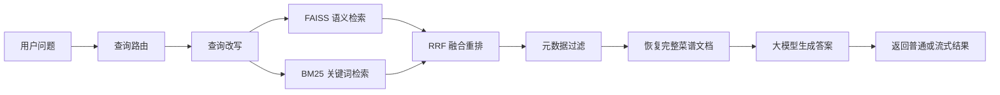

# How-to-eat

How-to-eat 是一个面向中文菜谱的 RAG 智能问答系统。项目将本地 Markdown 菜谱整理为知识库，通过 FAISS 向量检索、BM25 关键词检索、RRF 融合重排和大语言模型生成，为用户提供菜品推荐、做法查询、食材用量说明和烹饪步骤指导。

系统当前内置约 323 篇菜谱 Markdown 文档和约 328 张菜品图片，覆盖荤菜、素菜、汤品、甜品、早餐、主食、水产、调料、饮品、半成品等分类。

## 功能特性

- 本地菜谱知识库：递归加载 `data/cook/dishes` 下的 Markdown 菜谱。
- 结构化文档切分：按 Markdown 标题层级切分文档，并保留父子文档关系。
- 混合检索：结合 FAISS 语义检索与 BM25 关键词检索。
- RRF 重排：融合不同检索结果，提升召回稳定性。
- 元数据过滤：支持按菜品分类、难度等信息过滤检索结果。
- 查询路由：将问题区分为推荐列表、详细做法、一般问答等类型。
- 流式回答：后端支持流式输出，前端可实时展示回答。
- 简易 Web 界面：FastAPI 后端直接提供静态聊天页面。

## 技术栈

- Python
- FastAPI
- LangChain
- FAISS
- BM25
- HuggingFace Embeddings
- DashScope / OpenAI 兼容接口
- HTML / CSS / JavaScript

默认配置见 `code/config.py`：

- 嵌入模型：`BAAI/bge-small-zh-v1.5`
- 生成模型：`qwen3.5-35b-a3b`
- 数据目录：`../data/cook`
- 向量索引目录：`./vector_index`

## 项目结构

```text
.
├── .env.example                      # 环境变量示例文件
├── code/
│   ├── api_server.py                 # FastAPI 后端与前端入口
│   ├── RecipeRAGSystem.py            # RAG 系统主流程
│   ├── config.py                     # 系统配置
│   ├── index.html                    # 简易 Web 问答页面
│   ├── requirements.txt              # Python 依赖
│   ├── rag_modules/
│   │   ├── data_preparation.py       # 菜谱加载、元数据增强、Markdown 切分
│   │   ├── index_construction.py     # Embedding 初始化、FAISS 索引构建与加载
│   │   ├── retrieval_optimization.py # 混合检索、RRF 重排、元数据过滤
│   │   └── generation_integration.py # 查询路由、查询改写、答案生成
│   └── vector_index/
│       ├── index.faiss               # 已构建的 FAISS 索引
│       └── index.pkl                 # FAISS 元数据
├── data/
│   └── cook/
│       └── dishes/                   # 菜谱 Markdown 与配图
└── README.md
```

## 快速开始

### 1. 克隆项目

```bash
git clone <your-repo-url>
cd How-to-eat
```

### 2. 启用项目虚拟环境

本项目使用仓库根目录下的 `.venv` 虚拟环境运行。如果你本地已经有该目录，直接启用即可。

Windows PowerShell:

```powershell
.\.venv\Scripts\activate
```

macOS / Linux:

```bash
source .venv/bin/activate
```

如果是全新克隆的仓库且没有 `.venv`，可以先创建：

```bash
python -m venv .venv
```

### 3. 安装依赖

```bash
cd code
pip install -r requirements.txt
pip install fastapi uvicorn
```

说明：`api_server.py` 依赖 FastAPI 和 Uvicorn。如果你已经将它们加入 `requirements.txt`，第二条命令可以省略。

### 4. 配置 .env 文件

系统使用阿里云 DashScope 的 OpenAI 兼容接口，需要在项目根目录创建 `.env` 并填写 `ALI_API_KEY`。启动项目时，`code/config.py` 会自动加载该文件。

Windows PowerShell:

```powershell
Copy-Item .env.example .env
```

macOS / Linux:

```bash
cp .env.example .env
```

然后编辑 `.env`：

```env
ALI_API_KEY=your_dashscope_api_key
```

### 5. 启动服务

请在 `code/` 目录下启动。项目中的数据路径、索引路径和前端页面路径都按该工作目录配置。

```bash
uvicorn api_server:app --host 0.0.0.0 --port 8000
```

也可以运行：

```bash
python api_server.py
```

启动后访问：

```text
http://localhost:8000
```

首次运行时，如果本地没有 HuggingFace 嵌入模型缓存，程序会下载 `BAAI/bge-small-zh-v1.5`。仓库已包含 `code/vector_index`，正常情况下会优先加载已有索引；如果删除该目录，系统会重新构建索引。

## API 使用

### 提问接口

```http
POST /api/ask
Content-Type: application/json
```

请求体：

```json
{
  "question": "西红柿炒鸡蛋怎么做？",
  "stream": true
}
```

参数说明：

- `question`：用户问题。
- `stream`：是否启用流式输出。`true` 返回文本流，`false` 返回 JSON。

非流式响应示例：

```json
{
  "answer": "..."
}
```

## RAG 工作流程




## 配置说明

常用配置集中在 `code/config.py`：

```python
api_key_env_name = "ALI_API_KEY"
data_path = "../data/cook"
index_save_path = "./vector_index"
embedding_model = "BAAI/bge-small-zh-v1.5"
llm_model = "qwen3.5-35b-a3b"
top_k = 3
temperature = 0.1
max_tokens = 2048
```

如果需要更换模型，可以修改 `llm_model`、`embedding_model` 和 `GenerationIntegrationModule` 中的 `base_url` 配置。


## 未来计划
- 项目仍在优化中...