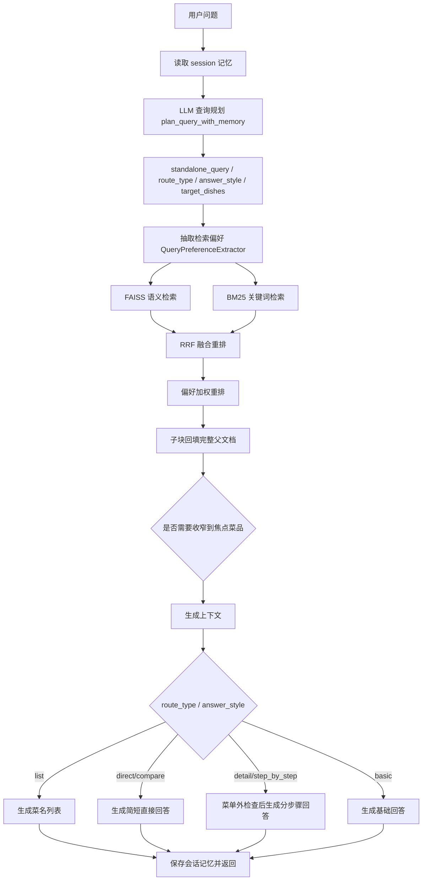

# How-to-eat

How-to-eat（尝尝咸淡）是一个面向中文菜谱的本地知识库 RAG 问答系统。项目会把仓库中的 Markdown 菜谱构建成可检索知识库，结合 FAISS 向量检索、BM25 关键词检索、RRF 融合重排、检索偏好重排和大语言模型生成，为用户提供菜品推荐、做法查询、食材/调料说明、烹饪步骤指导和多轮追问体验。

当前仓库内置 323 篇菜谱 Markdown 文档和 328 张菜品图片，覆盖荤菜、素菜、汤品、甜品、早餐、主食、水产、调料、饮品、半成品等分类。

## 核心能力

- 本地菜谱知识库：递归加载 `data/cook/dishes` 下的 Markdown 菜谱。
- 结构化分块：按 Markdown 标题层级切分文档，并保留父文档与子块映射。
- 混合检索：FAISS 语义检索 + BM25 关键词检索 + RRF 融合重排。
- 偏好重排：分类、难度、做法、正向关键词和负向约束只参与排序，避免过早硬过滤。
- LLM 查询规划：由模型结合当前问题、最近对话和结构化会话状态输出查询计划。
- 短期会话记忆：传入 `session_id` 后支持追问中的“这个/那个/它”等指代消解。
- 菜单外拒答：明确菜名不在本地菜谱库时，避免用相似菜谱编造完整做法。
- 增量新增菜谱：已有索引加载后，会自动检测新增 Markdown 菜谱并追加到 FAISS 索引。
- 流式生成：FastAPI 接口支持普通 JSON 响应和文本流式响应。
- RAGAS 评测：内置评测脚本、主测试集、菜单外专项测试集、trace、CSV 分数和 Markdown 报告。

## 技术栈

- Python
- FastAPI / Uvicorn
- LangChain
- FAISS
- BM25
- HuggingFace Embeddings
- OpenAI-compatible LLM API
- RAGAS
- HTML / CSS / JavaScript

## 配置

项目统一从 `.env` 读取配置，入口在 [code/config.py](code/config.py)。真实业务流程和 RAGAS 测评流程都使用同一个 `DEFAULT_CONFIG`。

最少需要配置：

```env
LLM_API_KEY=your_api_key_here
LLM_MODEL=deepseek-v4-flash
LLM_BASE_URL=https://api.deepseek.com
```

可选配置：

| 环境变量 | 默认值 | 说明 |
| --- | --- | --- |
| `RAG_DATA_PATH` | `../data/cook` | 菜谱数据目录 |
| `RAG_INDEX_SAVE_PATH` | `./vector_index` | FAISS 索引目录 |
| `EMBEDDING_MODEL` | `BAAI/bge-small-zh-v1.5` | 向量模型 |
| `RAG_TOP_K` | `3` | 最终进入生成阶段的候选数量 |
| `LLM_TEMPERATURE` | `0.1` | 生成温度 |
| `LLM_MAX_TOKENS` | `2048` | 单次生成上限 |

配置加载顺序：系统环境变量优先；项目根目录 `.env` 其次；`code/.env` 最后。同名变量不会被后加载的文件覆盖。

## 项目结构

```text
.
├── .env.example
├── README.md
├── docs/
│   └── RAG_API_INTERFACE.md
├── data/
│   └── cook/dishes/                 # 菜谱 Markdown 与配图
└── code/
    ├── api_server.py                # FastAPI 服务入口
    ├── RecipeRAGSystem.py           # RAG 主流程编排
    ├── config.py                    # 配置与 .env 加载
    ├── index.html                   # 简易聊天页面
    ├── requirements.txt
    ├── rag_modules/
    │   ├── conversation_memory.py   # session 级短期记忆
    │   ├── data_preparation.py      # 文档加载、元数据增强、Markdown 分块
    │   ├── generation_integration.py# LLM 查询规划与答案生成
    │   ├── index_construction.py    # Embedding、FAISS 构建/加载/增量追加
    │   ├── menu_safety.py           # 菜单外拒答
    │   ├── pipeline_models.py       # RAG pipeline 结果模型
    │   ├── query_preferences.py     # 检索偏好抽取
    │   └── retrieval_optimization.py# 混合检索、RRF、偏好重排
    ├── evaluation/
    │   ├── datasets/                # JSONL 评测集
    │   └── run_ragas_eval.py        # RAGAS 评测入口
    └── vector_index/                # 已构建的 FAISS 索引
```

## 数据分类

`data/cook/dishes` 当前包含：

| 目录 | 分类 | Markdown 数量 |
| --- | --- | ---: |
| `meat_dish` | 荤菜 | 97 |
| `vegetable_dish` | 素菜 | 54 |
| `staple` | 主食 | 47 |
| `aquatic` | 水产 | 24 |
| `breakfast` | 早餐 | 22 |
| `drink` | 饮品 | 21 |
| `soup` | 汤品 | 21 |
| `dessert` | 甜品 | 17 |
| `semi-finished` | 半成品 | 10 |
| `condiment` | 调料 | 9 |
| `template` | 菜谱模板 | 1 |

系统会根据目录推断菜品分类，根据文件名推断菜品名称，并根据正文中的 `★` 数量推断烹饪难度。

## 快速开始

### 1. 克隆仓库

```bash
git clone https://github.com/<your-name>/How-to-eat.git
cd How-to-eat
```

### 2. 创建虚拟环境

Windows PowerShell:

```powershell
python -m venv .venv
.\.venv\Scripts\activate
python -m pip install --upgrade pip
```

macOS / Linux:

```bash
python -m venv .venv
source .venv/bin/activate
python -m pip install --upgrade pip
```

### 3. 安装依赖

```bash
python -m pip install -r code/requirements.txt fastapi uvicorn
```

### 4. 配置环境变量

复制环境变量示例文件：

```bash
cp .env.example .env
```

Windows PowerShell:

```powershell
Copy-Item .env.example .env
```

编辑 `.env`：

```env
LLM_API_KEY=your_api_key_here
LLM_MODEL=deepseek-v4-flash
LLM_BASE_URL=https://api.deepseek.com
```

### 5. 启动服务

请从 `code/` 目录启动服务，因为默认数据路径和索引路径都是按该工作目录配置的。

```bash
cd code
python -m uvicorn api_server:app --host 0.0.0.0 --port 8000
```

启动后访问：

```text
http://localhost:8000
```

首次运行时，如果本地没有 `BAAI/bge-small-zh-v1.5` 缓存，程序会下载嵌入模型。仓库已包含 `code/vector_index` 时会优先加载已有索引；如果索引目录不存在，系统会读取菜谱并构建新的 FAISS 索引。

## API 使用

### 获取前端页面

```http
GET /
```

返回 `code/index.html`。

### 提问接口

```http
POST /api/ask
Content-Type: application/json
```

请求体：

```json
{
  "question": "懒人蛋挞怎么做？",
  "stream": false,
  "session_id": "browser-session-id"
}
```

字段说明：

| 字段 | 类型 | 默认值 | 说明 |
| --- | --- | --- | --- |
| `question` | string | 必填 | 用户问题 |
| `stream` | boolean | `true` | 是否启用文本流式返回 |
| `session_id` | string | 无 | 可选会话 ID；传入后启用当前进程内短期对话记忆 |

非流式响应：

```json
{
  "answer": "这里是完整回答"
}
```

流式响应：

```text
Content-Type: text/plain; charset=utf-8
```

多轮追问示例：

1. `懒人蛋挞怎么做？`
2. `这个要烤多久，烤箱多少度？`

如果两次请求使用同一个 `session_id`，第二轮会结合会话状态把“这个”解析为“懒人蛋挞”。

## RAG 工作流程



## 增量新增菜谱

新增 Markdown 菜谱后，正常重启服务即可。系统加载已有 FAISS 索引后会：

1. 重新扫描 `data/cook/dishes`。
2. 根据菜谱相对路径生成稳定 `parent_id`。
3. 对比当前索引中已有的 `parent_id`。
4. 只把新增菜谱对应的 chunks 追加到 FAISS。
5. 保存更新后的索引。

当前增量逻辑只处理“新增文件”。如果修改了已有菜谱内容或删除了菜谱，需要删除 `code/vector_index` 后全量重建索引。

## 评测

评测入口：

```text
code/evaluation/run_ragas_eval.py
```

默认主测试集：

```text
code/evaluation/datasets/eval_dataset.jsonl
```

只运行 RAG trace，不调用 RAGAS：

```bash
python code/evaluation/run_ragas_eval.py --limit 3 --skip-ragas
```

运行主测试集前 6 条并调用 RAGAS：

```bash
python code/evaluation/run_ragas_eval.py --limit 6 --batch-size 2 --ragas-timeout 240
```

运行菜单外专项：

```bash
python code/evaluation/run_ragas_eval.py --dataset code/evaluation/datasets/out_of_scope_dataset.jsonl --skip-ragas
```

评测流程复用生产链路 `run_question_pipeline`，并使用同一份 `.env` / `DEFAULT_CONFIG`。输出文件：

| 输出文件 | 说明 |
| --- | --- |
| `code/evaluation/runs/latest_trace.jsonl` | 每条样例的规划、检索、上下文和回答 trace |
| `code/evaluation/runs/latest_scores.csv` | 每条样例的业务指标、planner 指标和 RAGAS 指标 |
| `code/evaluation/reports/latest_report.md` | Markdown 汇总报告 |


说明：`list` 推荐题是开放集合问题，`context_recall` 只表示测试集代表菜覆盖，不等价于推荐是否正确。

## 添加菜谱

1. 在 `data/cook/dishes/<category>/` 下新增 Markdown 文件，文件名会被系统作为菜品名称。
2. 按 Markdown 标题组织内容，建议明确写出食材、用量、步骤、时间和工具。
3. 用 `预估烹饪难度：★` 到 `★★★★★` 标注难度。
4. 菜品图片可以放在同级目录，并在 Markdown 中使用相对路径引用。
5. 重启服务后，新增菜谱会自动追加到索引。

支持的分类目录由 `DataPreparationModule.CATEGORY_MAPPING` 维护：

```text
meat_dish, vegetable_dish, soup, dessert, breakfast,
staple, aquatic, condiment, drink, semi-finished
```

## 常见问题

### 提示数据路径不存在

默认配置假设服务从 `code/` 目录启动。请先 `cd code`，再运行 `python -m uvicorn api_server:app --host 0.0.0.0 --port 8000`。

### 提示缺少 API Key

确认项目根目录存在 `.env`，并包含：

```env
LLM_API_KEY=your_api_key_here
```

### 首次启动很慢

首次运行可能需要下载 HuggingFace embedding 模型，并加载或构建 FAISS 索引。之后会复用本地缓存和 `code/vector_index`。

### Web 页面请求失败

确认后端运行在 `http://localhost:8000`。当前前端页面中的接口地址固定为 `http://localhost:8000/api/ask`。

## 边界与安全说明

- 本项目只基于本地菜谱库回答，不保证覆盖所有菜品。
- 具体菜名不在本地库中时，系统会尽量拒绝编造完整做法。
- 短期记忆只保存在当前服务进程内，不做数据库持久化。
- 健康、医学、营养、热量和特殊人群饮食建议不属于当前系统的可靠能力范围。
- `code/vector_index/index.pkl` 是 FAISS 本地索引元数据，加载时涉及 pickle 反序列化；请只加载可信来源的索引文件。
- 不要把真实 `.env` 或 API Key 提交到公开仓库。

## 贡献

欢迎贡献新菜谱、检索策略、评测样例和前端体验改进。提交前建议：

1. 确认新增菜谱可以被 UTF-8 正确读取。
2. 确认 Markdown 标题结构清晰，原料、用量和步骤尽量明确。
3. 运行一次小规模评测或接口烟测，确认服务可以正常启动和回答。
4. 不提交本地密钥、缓存、日志和评测运行产物。


